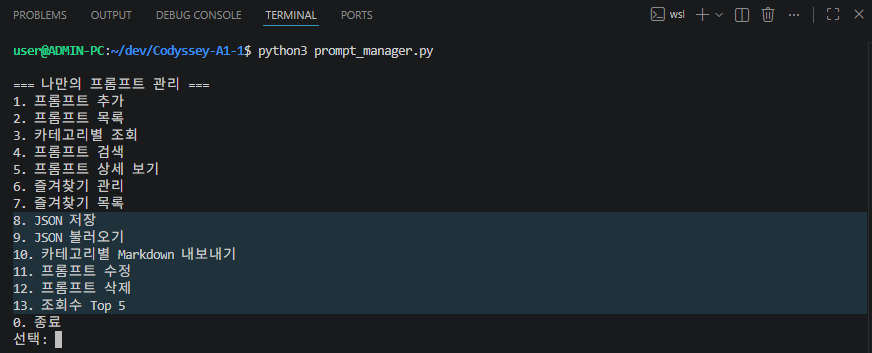
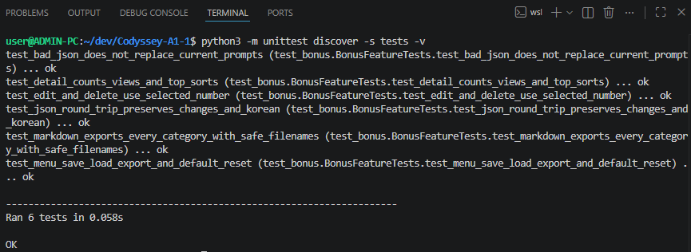

# 나만의 프롬프트 관리

Python 3.10 이상에서 실행하는 콘솔 기반 프롬프트 관리 프로그램입니다. 외부 라이브러리는 필요하지 않습니다.

## 환경 확인

```bash
python3 --version
git --version
python3 hello.py
```

`hello.py`는 개발 환경 확인용으로 `Hello`를 출력합니다.

## 실행

```bash
python3 prompt_manager.py
```

Windows에서 `python3` 명령이 없다면 `python`으로 바꾸어 실행하세요.

## 기능

메뉴 번호를 입력하여 다음 기능을 사용할 수 있습니다.

| 번호 | 기능 |
| --- | --- |
| 1 | 제목, 내용, 카테고리를 입력하여 프롬프트 추가 |
| 2 | 전체 목록과 즐겨찾기 표시 |
| 3 | 카테고리별 조회 |
| 4 | 제목 또는 내용에서 키워드 검색 |
| 5 | 전체 내용 상세 보기 |
| 6 | 즐겨찾기 추가 또는 해제 |
| 7 | 즐겨찾기 목록 |
| 8 | JSON 저장 (`prompts.json`) |
| 9 | JSON 불러오기 (`prompts.json`) |
| 10 | 카테고리별 Markdown 내보내기 (`exports/` 카테고리별 파일) |
| 11 | 프롬프트 수정 |
| 12 | 프롬프트 삭제 |
| 13 | 조회수 Top 5 |
| 0 | 종료 |

카테고리 기본 목록은 **텍스트 생성, 이미지 생성, 영상 생성, 페르소나, 자동화, 기타**입니다. 추가할 때 직접 카테고리 이름을 입력할 수도 있습니다. 기본 실행은 메모리에 초기화되며, 종료 후에는 초기화됩니다. 저장된 내용을 다시 쓰려면 메뉴 `9`를 선택할 때만 `prompts.json`에서 불러옵니다.

### 보너스 기능 사용법

- `8 JSON 저장`: 현재 목록을 프로젝트 실행 디렉터리의 `prompts.json`에 딕셔너리 목록으로 저장합니다.
- `9 JSON 불러오기`: 프로젝트 실행 디렉터리의 `prompts.json`을 읽어 현재 목록을 교체합니다. 파일이 없거나 형식이 맞지 않으면 안내 후 기존 목록을 유지합니다. 프로그램 시작 시 자동으로 불러오지 않습니다.
- `10 카테고리별 Markdown 내보내기`: 카테고리마다 `exports/` 폴더에 Markdown 파일로 나눠 저장합니다.
- `11 수정`: 번호로 항목을 고른 뒤 제목·내용·카테고리를 다시 입력합니다. 빈 입력은 현재 값을 유지합니다.
- `12 삭제`: 번호로 항목을 고른 뒤 확인을 거쳐 삭제합니다. 확인하지 않으면 삭제하지 않습니다.
- `13 조회수 Top 5`: 상세 보기에서 누적된 조회수를 기준으로 상위 5개를 보여줍니다.
- 상세 보기(`5`)는 열람할 때마다 해당 항목의 `view_count`를 1씩 올립니다.
- 제목 중복은 허용하며, 수정·삭제·상세 보기·즐겨찾기는 제목이 아니라 목록 번호로 항목을 구분합니다.

## 기본 데이터

프로그램 시작 시 [`sample_prompts.py`](sample_prompts.py)의 프롬프트 3개가 기본 등록됩니다. 등록된 프롬프트는 블로그 글 작성 도우미(텍스트 생성), 제품 썸네일 이미지(이미지 생성), Python 기초 학습 코치(페르소나)입니다. 각 항목은 `title`, `content`, `category`, `favorite`, `view_count` 값을 포함합니다. `view_count`는 상세 보기(`5`)에서 열람할 때마다 1씩 오릅니다.

## 프로그램 설계

### 함수별 책임

입력 처리, 데이터 변경, 결과 출력을 기능별 함수로 나눴습니다. 한 메뉴의 동작을 수정할 때 다른 메뉴의 코드를 건드리지 않고, 번호·빈값 검사도 여러 메뉴에서 같은 규칙으로 재사용하기 위해서입니다.

| 함수 | 책임 |
| --- | --- |
| `read_nonempty()` | 앞뒤 공백을 제거하고 빈 입력이면 다시 요청합니다. |
| `choose_category()` | 기본 및 현재 등록된 카테고리를 보여주고 번호를 해석합니다. 추가 메뉴에서는 새 이름도 받습니다. |
| `add_prompt()` | 제목·내용·카테고리를 입력받아 리스트에 딕셔너리를 추가합니다. |
| `show_list()` | 모든 프롬프트의 번호·제목·카테고리·즐겨찾기 표시를 출력합니다. |
| `show_category()` | 선택한 카테고리에 속한 항목만 출력합니다. |
| `search_prompt()` | 제목 또는 내용에 검색어가 포함된 항목을 찾습니다. 영문 대소문자는 구별하지 않습니다. |
| `choose_prompt_index()` / `choose_prompt()` | 번호 범위를 검사하고 선택한 항목의 위치 또는 내용을 반환합니다. |
| `show_detail()` | 선택한 항목의 제목·카테고리·즐겨찾기·조회수·내용 전체를 보여주고 조회수를 1 올립니다. |
| `toggle_favorite()` | 선택한 항목의 즐겨찾기 값을 반대로 바꿉니다. |
| `show_favorites()` | 즐겨찾기한 항목만 모아 보여줍니다. |
| `show_menu()` / `main()` | 메뉴 `0`부터 `13`을 출력하고 번호에 따라 함수를 호출하거나 종료합니다. |
| `save_json()` / `load_json()` | 현재 목록을 `prompts.json`에 저장하고, 파일 형식을 확인한 뒤 목록을 불러옵니다. |
| `export_markdown()` | `exports/` 폴더에 카테고리별 Markdown 파일을 만듭니다. |
| `edit_prompt()` | 번호로 고른 항목을 수정합니다. 빈 입력은 현재 값을 유지합니다. |
| `delete_prompt()` | 번호로 고른 항목을 확인 절차를 거쳐 삭제합니다. |
| `show_top()` | `view_count` 상위 5개를 보여줍니다. |

### 입력 검증과 반복 종료

- 추가 메뉴의 제목·내용·카테고리 선택과 검색어는 공백만 입력해도 빈값으로 취급하고 다시 요청합니다. 수정 메뉴의 빈 입력은 현재 값을 유지합니다.
- 카테고리 번호는 화면에 표시된 `1`부터 마지막 번호까지만 받습니다. 추가할 때는 숫자가 아닌 새 카테고리 이름을 직접 입력할 수 있습니다. 범위 밖의 숫자는 다시 요청합니다.
- 상세 보기와 즐겨찾기 관리, 수정·삭제의 프롬프트 번호는 `1`부터 현재 목록 길이까지만 유효합니다. 문자·`0`·범위 밖 번호는 안내 후 메뉴로 돌아갑니다.
- 수정에서는 빈 입력은 현재 값을 유지합니다. 삭제에서는 확인 입력이 있을 때만 삭제합니다.
- `9` 불러오기는 `prompts.json`이 없거나 형식이 맞지 않으면 안내 후 기존 목록을 유지합니다.
- 메뉴에 없는 번호나 문자를 입력하면 안내 후 메뉴를 다시 보여줍니다. `main()`의 `while` 반복은 `0`을 입력하면 `break`로 끝납니다. 입력 종료(EOF)나 `Ctrl+C`도 최상위 예외 처리에서 종료 메시지를 출력하고 끝냅니다. 각 기능을 마치면 반복문의 다음 순서에서 메뉴가 다시 표시됩니다.

### 자료구조와 데이터 정책

프롬프트는 **리스트 안의 딕셔너리**로 저장합니다. 리스트는 추가 순서를 유지하고 화면 번호를 붙이기 쉽지만, 제목·내용 검색에는 전체 항목을 순서대로 확인해야 합니다. 딕셔너리는 `title`, `content`, `category`, `favorite`, `view_count`처럼 이름으로 필드를 읽고 수정하기 쉽지만, 필수 키를 누락하면 오류가 나므로 기본 데이터와 추가·불러오기 함수에서 같은 키를 사용합니다.

같은 제목은 **허용**합니다. 서로 다른 내용의 프롬프트를 같은 제목으로 등록할 수 있으며, 상세 보기·즐겨찾기·수정·삭제는 제목이 아니라 목록의 **번호**로 구분합니다.

기본 실행은 메모리에 초기화되며 종료 시 초기화됩니다. 보너스 기능으로 표준 라이브러리 `json`을 사용해 프로젝트 실행 디렉터리의 `prompts.json`에 **딕셔너리 목록**을 저장합니다. `8`에서 저장하고, `9`를 선택할 때만 같은 파일을 읽어 목록을 교체합니다. 카테고리별 Markdown 내보내기는 `exports/` 폴더에 카테고리별 파일로 나눠 저장합니다.

카테고리를 추가·수정하려면 [`prompt_manager.py`](prompt_manager.py)의 `CATEGORIES` 목록을 바꾸세요. `choose_category()`는 이 목록과 실행 중 등록된 프롬프트의 카테고리를 합쳐 중복 없이 보여줍니다. 기본 프롬프트의 카테고리 이름도 바꾸려면 [`sample_prompts.py`](sample_prompts.py)의 `category` 값을 함께 수정하세요. 실행 중 직접 입력한 새 카테고리는 해당 실행에서만 목록에 나타납니다.

## 검증

다음 명령으로 [`tests/test_bonus.py`](tests/test_bonus.py)의 자동화 테스트를 실행할 수 있습니다. JSON 왕복 저장과 잘못된 파일 처리, 카테고리별 내보내기, 수정·삭제, 조회수 정렬, 메뉴를 통한 재실행·불러오기 흐름을 확인합니다.

```bash
python3 -m unittest discover -s tests -v
```

현재 6개 테스트가 모두 통과합니다. 기존 메뉴의 추가·목록·카테고리 조회·검색·상세 보기·즐겨찾기도 별도 실행 시나리오로 확인했습니다.

## Git 기록과 제출

커밋은 **한 기능 또는 한 종류의 문서 변경**을 기준으로 나눴습니다. 메시지는 무엇을 바꿨는지 동사와 대상을 넣어 설명합니다. 실제 기록의 예시는 `Add validated prompt entry and category selection`, `Search prompt titles and content by keyword`입니다. 빈 파일을 늘려 커밋 수만 채우지 않고 메뉴, 입력, 조회, 검색, 즐겨찾기 등을 각각 기록했습니다.

목록 출력은 다른 메뉴와 독립된 기능이라 `feature/prompt-list` 브랜치에서 작업했습니다. 목록 함수와 메뉴 연결을 완성해 커밋한 뒤 `main`으로 돌아와 `merge --no-ff`로 병합했습니다. 이 방식은 기능 브랜치의 작업과 병합 시점을 그래프에 남깁니다. 이후 작은 기능은 `main`에서 각각 기능 단위로 커밋했습니다. 다음 명령으로 실제 병합 기록을 확인할 수 있습니다.

실제로 사용한 브랜치 체크아웃과 병합 명령은 다음과 같습니다.

```bash
git checkout -b feature/prompt-list
# 목록 기능을 구현하고 e955722 커밋 생성
git checkout main
git merge --no-ff feature/prompt-list -m 'Merge prompt list feature'
```

로컬 `git reflog`에 남은 **체크아웃 기록**은 아래와 같습니다. `reflog`는 로컬 기록이므로 새로 복제한 저장소에는 이 출력이 그대로 남지 않습니다.

```text
$ git reflog --date=iso --all --grep-reflog='checkout:' --format='%h %gd %gs'
8fdc1c7 HEAD@{2026-09-28 13:04:36 +0900} checkout: moving from feature/prompt-list to main
8fdc1c7 HEAD@{2026-09-28 13:04:13 +0900} checkout: moving from main to feature/prompt-list
```

`e955722`은 기능 브랜치에서 만든 목록 기능 커밋이고, `bfcbd56`은 이를 `main`에 합친 병합 커밋입니다. 아래 그래프 명령과 제출 증빙 화면 8번에서도 두 커밋의 연결을 확인할 수 있습니다.

```bash
git log --oneline --graph --all
```

이번 병합에서는 충돌이 없었습니다. 충돌이 생기면 `git status`로 충돌 파일을 찾고 양쪽 변경과 충돌 표시(`<<<<<<<`, `=======`, `>>>>>>>`)를 확인합니다. 필요한 내용을 함께 남기도록 파일을 수정한 다음 `python3 -m py_compile prompt_manager.py sample_prompts.py`와 관련 메뉴 실행으로 검증합니다. 이어서 `git add <해결한 파일>`과 `git merge --continue`를 실행하고 `git log --oneline --graph --all`로 병합 결과를 확인합니다.

### 공개 샘플 저장소 clone 확인

공개 샘플 저장소를 별도의 임시 폴더에 내려받고 파일 구조와 커밋을 확인했습니다. 아래는 실제 실행 출력입니다.

```text
$ git clone --depth 1 https://github.com/octocat/Hello-World.git /tmp/codyssey-clone-proof.vaO4WO/Hello-World
Cloning into '/tmp/codyssey-clone-proof.vaO4WO/Hello-World'...
$ ls -la /tmp/codyssey-clone-proof.vaO4WO/Hello-World
total 16
drwxr-xr-x 3 user user 4096 Sep 28 17:46 .
drwx------ 3 user user 4096 Sep 28 17:46 ..
drwxr-xr-x 8 user user 4096 Sep 28 17:46 .git
-rw-r--r-- 1 user user   13 Sep 28 17:46 README
$ git -C /tmp/codyssey-clone-proof.vaO4WO/Hello-World log -1 --oneline
7fd1a60 Merge pull request #6 from Spaceghost/patch-1
```

GitHub 저장소: [highslow1536/Codyssey-A1-1](https://github.com/highslow1536/Codyssey-A1-1)

현재 프로젝트는 `origin`에 연결되어 있습니다. 이후 변경사항은 다음 명령으로 업로드하고 동기화할 수 있습니다.

```bash
git push origin main
git pull origin main
```

## 제출 증빙 화면

1~8번은 필수 기능을 확인한 화면이고, 9~10번은 보너스 메뉴와 자동화 테스트 결과입니다.

### 개발 환경

**1. VSCode Python 확장 설치** — Microsoft의 Python 확장에 `Uninstall` 버튼이 표시됩니다.


**2. Python 버전** — `python3 --version` 실행 결과입니다.


**3. Git 버전과 사용자 설정** — `git --version`, `git config user.name`, `git config user.email` 실행 결과입니다.


### 프로그램 실행

**4. 시작 메뉴** — `python3 prompt_manager.py` 실행 화면입니다.


**5. 새 프롬프트 추가** — 제목, 내용, 카테고리를 입력해 등록한 화면입니다.


**6. 전체 목록** — 기본 프롬프트 3개와 새로 추가한 프롬프트가 보입니다.


**7. 키워드 검색** — 추가한 프롬프트를 `제주도`로 검색한 결과입니다.


### Git 이력

**8. 커밋과 브랜치 병합** — `git log --oneline --graph --all` 실행 결과입니다.


### 보너스 기능

**9. 보너스 메뉴** — JSON 저장·불러오기, 카테고리별 Markdown 내보내기, 수정·삭제, 조회수 Top 5 메뉴가 표시됩니다.



**10. 자동화 테스트** — JSON 왕복 저장, Markdown 내보내기, 수정·삭제, 조회수 정렬 등 6개 테스트가 모두 통과한 결과입니다.


