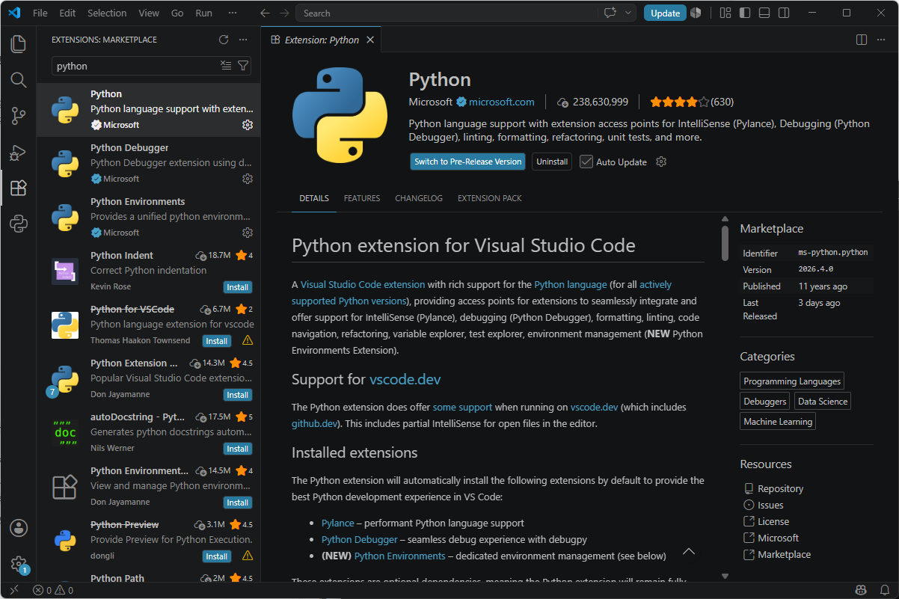
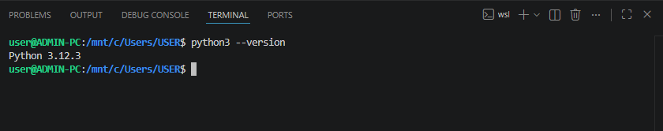
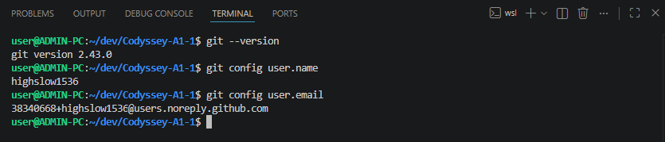
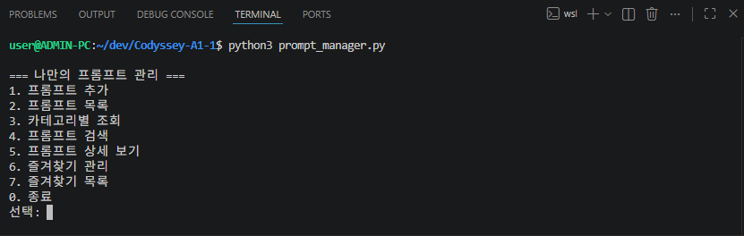
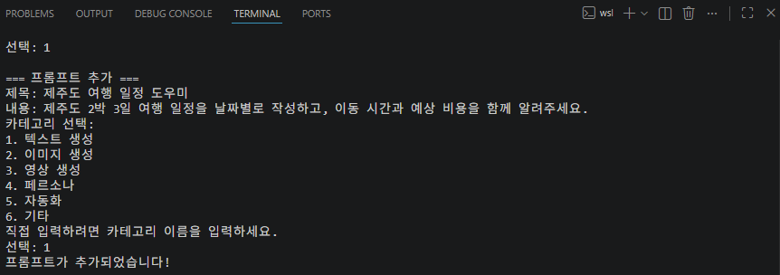
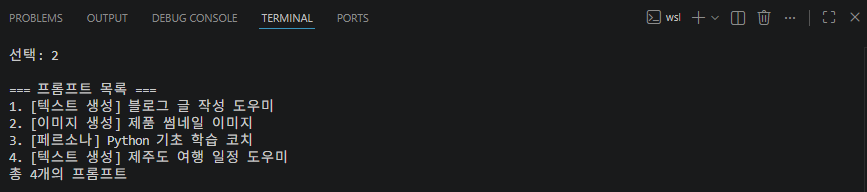
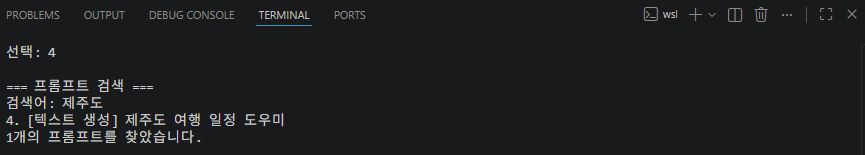
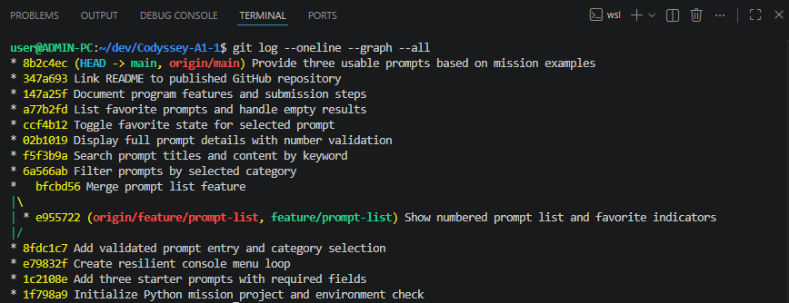

# 나만의 프롬프트 관리

Python 3.10 이상에서 실행하는 콘솔 기반 프롬프트 관리 프로그램입니다. 외부 라이브러리는 필요하지 않습니다.

## 환경 확인

```bash
python3 --version
git --version
python3 hello.py
```

`hello.py`는 개발 환경 확인용으로 `Hello`를 출력합니다.

## 실행

```bash
python3 prompt_manager.py
```

Windows에서 `python3` 명령이 없다면 `python`으로 바꾸어 실행하세요.

## 기능

메뉴 번호를 입력하여 다음 기능을 사용할 수 있습니다.

| 번호 | 기능 |
| --- | --- |
| 1 | 제목, 내용, 카테고리를 입력하여 프롬프트 추가 |
| 2 | 전체 목록과 즐겨찾기 표시 |
| 3 | 카테고리별 조회 |
| 4 | 제목 또는 내용에서 키워드 검색 |
| 5 | 전체 내용 상세 보기 |
| 6 | 즐겨찾기 추가 또는 해제 |
| 7 | 즐겨찾기 목록 |
| 0 | 종료 |

카테고리 기본 목록은 **텍스트 생성, 이미지 생성, 영상 생성, 페르소나, 자동화, 기타**입니다. 추가할 때 직접 카테고리 이름을 입력할 수도 있습니다. 실행 중 추가한 데이터와 즐겨찾기 상태는 메모리에 유지되며, 종료 후에는 초기화됩니다.

## 기본 데이터

[`sample_prompts.py`](sample_prompts.py)에 바로 사용할 수 있는 기본 프롬프트 3개가 등록되어 있습니다. 사용자가 받은 자료는 이 미션 PDF뿐이므로, PDF의 예시를 참고해 새로 작성했습니다. **이 프롬프트를 이전 미션에서 작성한 기록으로 주장할 수는 없습니다.** 각 항목은 `title`, `content`, `category`, `favorite` 값을 포함합니다.

## Git 기록과 제출

목록 기능은 `feature/prompt-list` 브랜치에서 작성하고 `main`으로 병합했습니다. 다음 명령으로 기록을 확인할 수 있습니다.

```bash
git log --oneline --graph --all
```

GitHub 저장소: [highslow1536/Codyssey-A1-1](https://github.com/highslow1536/Codyssey-A1-1)

현재 프로젝트는 `origin`에 연결되어 있습니다. 이후 변경사항은 다음 명령으로 업로드하고 동기화할 수 있습니다.

```bash
git push origin main
git pull origin main
```

## 제출 증빙 화면

### 개발 환경

**1. VSCode Python 확장 설치** — Microsoft의 Python 확장에 `Uninstall` 버튼이 표시됩니다.



**2. Python 버전** — `python3 --version` 실행 결과입니다.



**3. Git 버전과 사용자 설정** — `git --version`, `git config user.name`, `git config user.email` 실행 결과입니다.



### 프로그램 실행

**4. 시작 메뉴** — `python3 prompt_manager.py` 실행 화면입니다.



**5. 새 프롬프트 추가** — 제목, 내용, 카테고리를 입력해 등록한 화면입니다.



**6. 전체 목록** — 기본 프롬프트 3개와 새로 추가한 프롬프트가 보입니다.



**7. 키워드 검색** — 추가한 프롬프트를 `제주도`로 검색한 결과입니다.



### Git 이력

**8. 커밋과 브랜치 병합** — `git log --oneline --graph --all` 실행 결과입니다.


